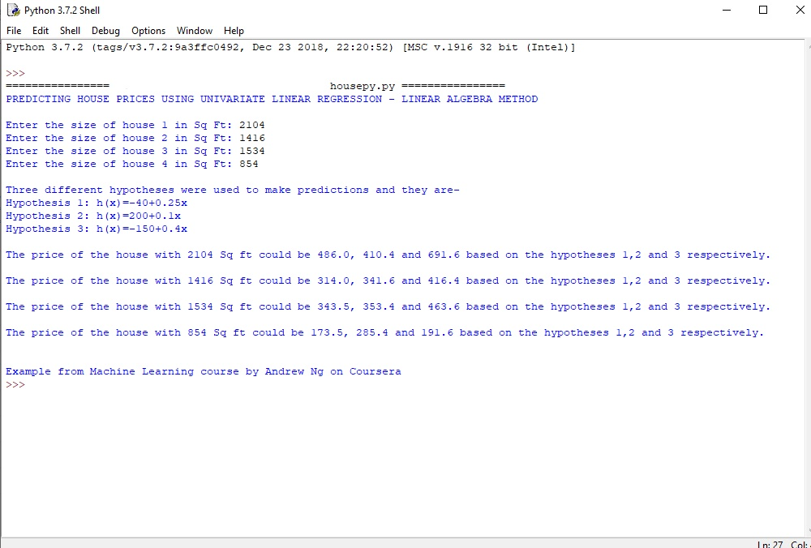

# house_price_prediction
A Python program to predict the house prices using univariate linear regression with linear algebra method. The hypotheses used for prediction are from an example problem in the Machine Learning course by Andrew Ng on Coursera.

<h3>Test Run:</h3>

